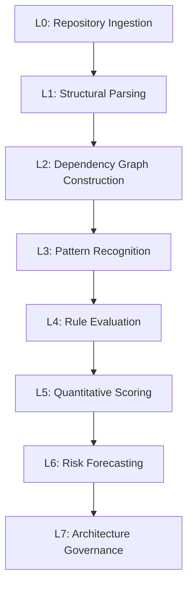
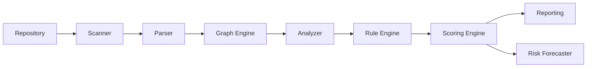

# ARCH-001 — Product Vision, Mission, and Infrastructure Philosophy

---

## Metadata

| Field       | Value                |
| ----------- | -------------------- |
| Document ID | ARCH-001             |
| Version     | 1.0.0                |
| Status      | DRAFT                |
| Owner       | ArchLens Core Team   |
| Created     | 2026-06-02           |
| Phase       | Phase 1 — Foundation |

---

## Purpose

Establishes the foundational identity of ArchLens — what it is, why it exists, and the principles that govern its design and evolution. This is the root document; all subsequent specifications trace back here.

---

## Scope

- Product vision and mission.
- Definition of Architecture Intelligence.
- Infrastructure philosophy and binding design constraints.
- Conceptual data flow and component overview.

---

## Background

Modern engineering teams instrument code quality, testing, observability, security, and CI/CD — but software architecture remains uninstrumented. Architecture decisions are made once, documented in decaying wikis, violated silently, and understood implicitly by senior engineers who eventually leave.

The result: systems decay not because of bad code, but because architectural integrity erodes without measurement, visibility, or enforcement.

No existing tool treats architecture as a continuously observable, measurable, and governable engineering artifact. ArchLens fills this gap.

---

## Product Vision

> **ArchLens provides continuous, evidence-based architecture intelligence for software repositories — making structural health as observable as runtime behavior.**

Three constraints encoded in this statement:

1. **Continuous** — not a one-time assessment; designed for CI integration and ongoing governance.
2. **Evidence-based** — every output is traceable to concrete structural evidence. No opaque heuristics.
3. **Architecture intelligence** — operates at module/package/layer/boundary level, not line-of-code level.

---

## What ArchLens Is

An **Architecture Intelligence Platform** that analyzes repositories to provide:

- Architecture quality scores
- Dependency health analysis
- Maintainability evaluation
- Scalability assessment
- Technical debt quantification
- Architectural violation detection
- Risk forecasting
- Architecture governance

**Abstraction level**: Modules, packages, layers, boundaries, dependency graphs.
**Operational model**: CLI-first, CI-integrable, local-first.
**Analysis philosophy**: Static structural analysis with deterministic, explainable outputs.

---

## What ArchLens Is Not

| Not This                 | Why                                                |
| ------------------------ | -------------------------------------------------- |
| Code linter or formatter | Does not analyze code style or syntax              |
| Static code analyzer     | Does not detect code smells or function complexity |
| AI coding assistant      | Does not generate or suggest code                  |
| Chatbot                  | Produces reports and scores, not conversation      |
| Vulnerability scanner    | Does not detect CVEs or security vulnerabilities   |
| Test runner              | Does not execute tests or measure coverage         |
| Diagramming tool         | Does not produce editable architecture diagrams    |
| Runtime observability    | Does not instrument running applications           |

---

## Mission

> **Make software architecture a measurable, observable, and governable engineering discipline.**

### Pillar 1 — Measurability

Architecture quality is quantified through defined metrics: coupling, cohesion, instability, dependency depth, fan-in/fan-out, boundary clarity, and technical debt accumulation. Every metric has a formula, evidence link, and explanation.

### Pillar 2 — Observability

Architecture health is continuously visible — scores are the analogue of SLIs, violations are the analogue of error logs, dependency graphs are the analogue of traces.

### Pillar 3 — Governability

Architecture is enforceable through configurable rules, CI quality gates, violation tracking, and trend analysis.

---

## Architecture Intelligence Hierarchy



| Level | Name                          | Description                                                                                  |
| ----- | ----------------------------- | -------------------------------------------------------------------------------------------- |
| L0    | Repository Ingestion          | Ingest repository as file system structure                                                   |
| L1    | Structural Parsing            | Parse source files into structural representations (ASTs, module maps, import/export graphs) |
| L2    | Dependency Graph Construction | Resolve dependencies into a typed directed graph                                             |
| L3    | Pattern Recognition           | Detect architectural patterns: layering, modularity, coupling clusters, boundary definitions |
| L4    | Rule Evaluation               | Evaluate structures against configurable architectural constraints                           |
| L5    | Quantitative Scoring          | Aggregate violations and metrics into multi-dimensional scores                               |
| L6    | Risk Forecasting              | Detect structural trends and produce forward-looking risk assessments                        |
| L7    | Architecture Governance       | Enforce scores and rules as CI/CD quality gates                                              |

Every package and feature maps to one or more levels in this hierarchy.

---

## Architectural Decisions

### AD-001: Module-Level Analysis Only

ArchLens analyzes at the module/package/layer level. It does not analyze individual functions, classes, or lines. Code-level analysis is a different domain.

### AD-002: Evidence-Based, Explainable Outputs

Every score, violation, and risk assessment is traceable to specific structural evidence. No output is produced by an opaque process. Every finding answers: what was found, where, why it matters, how it was measured, and what to do about it.

### AD-003: CLI-First, CI-Integrable, Local-First

- CLI-first: `archlens analyze .` — zero config, immediate value.
- CI-integrable: quality gates that enforce rules on every PR.
- Local-first: source code never leaves the machine. No cloud, no accounts, no network dependency.

### AD-004: Modular Package Architecture

Monorepo of focused packages with well-defined boundaries. Each package owns a single responsibility. ArchLens practices what it preaches.

### AD-005: Deterministic, Reproducible Analysis

Same repository state → identical results every time. No random, probabilistic, or externally-dependent components. Prerequisite for CI enforcement and debugging.

---

## Infrastructure Philosophy

These are binding constraints. Violations require explicit exemption via RFC.

### 1. Architecture as First-Class Citizen

Architecture decisions are documented before implementation. Package boundaries map to architectural concepts. Dependency flow is explicit, unidirectional, and enforced.

### 2. Documentation-First Development

No feature is implemented before its design is documented and reviewed.

```
Architecture Spec (ARCH-xxx) → RFC (RFC-xxx) → Engineering Doc (ENG-xxx) → Implementation → Tests
```

### 3. Explainability Over Sophistication

When choosing between a sophisticated opaque algorithm and a simpler explainable one, choose explainability. Complexity is allowed; opacity is not.

### 4. Composability Over Completeness

ArchLens does one thing well and composes with the broader toolchain. Machine-readable outputs (JSON, SARIF), CI-compatible exit codes, pluggable architecture.

### 5. Progressive Disclosure

| Stage         | Experience                                              |
| ------------- | ------------------------------------------------------- |
| First use     | `npx archlens analyze .` — zero config, immediate value |
| Configuration | `archlens.config.ts` — custom rules and thresholds      |
| Governance    | CI quality gates                                        |
| Extension     | Custom rule/analyzer/scorer plugins                     |

### 6. Open-Source Quality Standards

Comprehensive testing, strict TypeScript (no `any` in public APIs), semantic versioning, automated CI, public documentation, contribution-ready structure.

### 7. Eat Your Own Dog Food

ArchLens must be analyzable by ArchLens and score well on its own metrics.

### 8. Stability Over Feature Velocity

Correctness and reliability over rapid feature delivery. Incorrect analysis is worse than no analysis.

---

## Data Flow



| Stage           | Input                         | Output                                                 |
| --------------- | ----------------------------- | ------------------------------------------------------ |
| Scanner         | File system path              | File manifest                                          |
| Parser          | File manifest                 | Module map (per-file structural data, imports/exports) |
| Graph Engine    | Module map                    | Typed dependency graph                                 |
| Analyzer        | Dependency graph              | Analysis results (metrics, patterns, anomalies)        |
| Rule Engine     | Analysis results + rules      | Violation set                                          |
| Scoring Engine  | Analysis results + violations | Score card                                             |
| Reporting       | Scores + violations + results | Reports (Markdown, JSON, SARIF)                        |
| Risk Forecaster | Scores + historical data      | Risk assessments                                       |

**Immutability principle**: Each stage receives immutable input and produces new immutable output. No mutation of upstream data.

---

## Components

| Component      | Package               | Hierarchy Level |
| -------------- | --------------------- | --------------- |
| Scanner        | `@archlens/scanner`   | L0              |
| Parser         | `@archlens/parser`    | L1              |
| Graph Engine   | `@archlens/graph`     | L2              |
| Analyzer       | `@archlens/analyzer`  | L3              |
| Rule Engine    | `@archlens/rules`     | L4              |
| Scoring Engine | `@archlens/scoring`   | L5              |
| Reporting      | `@archlens/reporting` | L5–L7           |
| CLI            | `@archlens/cli`       | Orchestration   |
| Shared         | `@archlens/shared`    | Cross-cutting   |
| Types          | `@archlens/types`     | Cross-cutting   |

**Dependency rules**:

1. No circular dependencies between packages.
2. `@archlens/types` depends on nothing. `@archlens/shared` depends only on `types`.
3. Data flows downward: higher-level packages depend on lower-level, never reverse.
4. CLI is the only package that depends on all others.
5. No package depends on CLI.

---

## Risks

| Risk                                      | Likelihood | Impact   | Mitigation                                                 |
| ----------------------------------------- | ---------- | -------- | ---------------------------------------------------------- |
| Scope creep into code-level analysis      | High       | High     | Strict identity definition, feature triage against mission |
| Scoring perceived as arbitrary            | Medium     | Critical | Evidence-based scoring, transparent methodology            |
| "Too complex" perception blocks adoption  | Medium     | High     | Progressive disclosure, zero-config first use              |
| Community expects AI/ML features          | High       | Medium   | Clear positioning as structural analysis, not AI           |
| Internal architecture fails own standards | Low        | Critical | Dogfooding in CI                                           |

---

## Open Questions

| #   | Question                                                           |
| --- | ------------------------------------------------------------------ |
| OQ1 | Should ArchLens analyze compiled/transpiled output or source only? |
| OQ2 | How should monorepos with multiple logical projects be handled?    |
| OQ3 | Should MVP include historical comparison between commits?          |
| OQ4 | Maximum repository size for MVP?                                   |
| OQ5 | Should ArchLens produce fix suggestions or findings only?          |
| OQ6 | How to handle framework-specific patterns (Next.js, NestJS)?       |

---

_End of ARCH-001_
