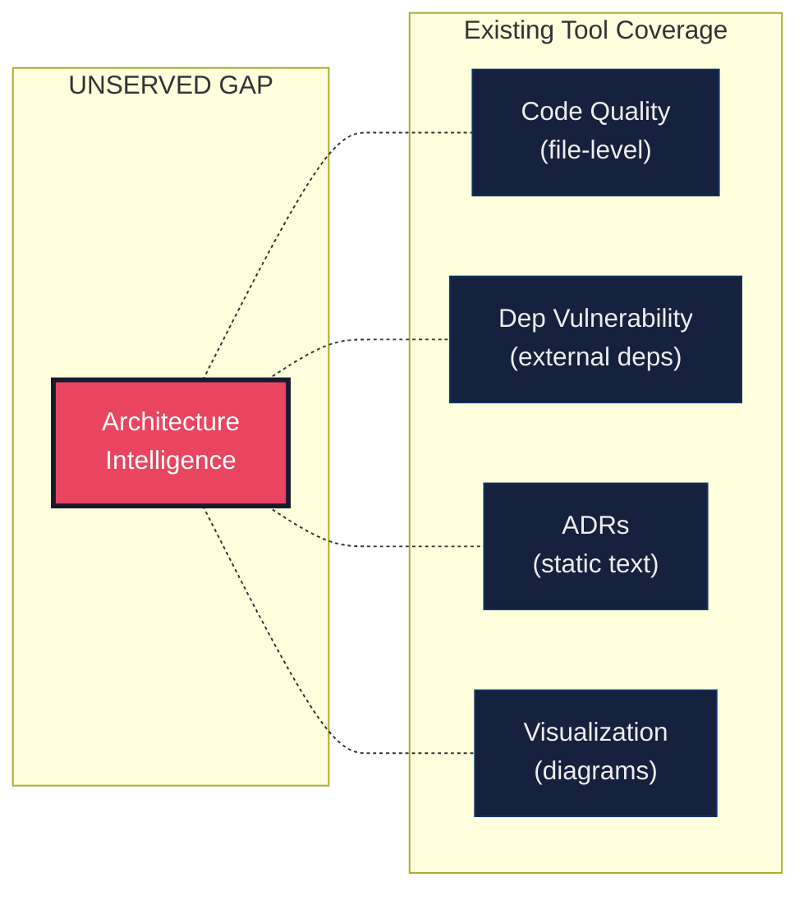

# ARCH-002 — Industry Problem Analysis and Market Gap Assessment

---

## Metadata

| Field       | Value                |
| ----------- | -------------------- |
| Document ID | ARCH-002             |
| Version     | 1.0.0                |
| Status      | DRAFT                |
| Owner       | ArchLens Core Team   |
| Created     | 2026-06-02           |
| Phase       | Phase 1 — Foundation |
| Depends On  | ARCH-001             |

---

## Purpose

Defines the industry problem ArchLens solves and identifies the gap in existing engineering tooling that ArchLens occupies.

---

## Scope

- Engineering problems caused by uninstrumented architecture.
- Categories of existing tools and their limitations.
- The specific gap ArchLens fills.

---

## The Problem

Software architecture degrades silently. Teams discover architectural problems only when they become crises — cascading failures, impossible refactors, multi-year rewrites, or engineering velocity collapse.

### Symptoms of Uninstrumented Architecture

| Symptom                       | Architectural Root Cause                                      |
| ----------------------------- | ------------------------------------------------------------- |
| Increasing build times        | Circular or overly coupled module dependencies                |
| "Big ball of mud" systems     | Boundary violations between logical modules                   |
| Cascading production failures | Hidden transitive dependencies                                |
| 3–6 month engineer onboarding | Implicit architectural knowledge, no structural documentation |
| Feature development paralysis | Accumulated invisible technical debt                          |
| Failed platform migrations    | Unknown dependency depth and coupling                         |
| Fear of refactoring           | No way to verify architectural impact of changes              |

These are not code-level problems. A fully linted, well-tested, formatted codebase can have catastrophic architectural flaws. Architecture operates at a higher abstraction — it requires its own instrumentation.

---

## Goals

- Articulate why architecture instrumentation does not exist today.
- Map existing tool categories and demonstrate that none address architecture intelligence.
- Define the precise gap ArchLens occupies.

---

## Non-Goals

- Competitive feature comparison or marketing positioning.
- Technology stack evaluation.
- ArchLens feature specification.

---

## Existing Tool Categories and Their Boundaries

### Code Quality Tools (Linters, Formatters, Static Analyzers)

**What they do**: Analyze individual files for code smells, complexity, style violations, and syntax patterns.

**What they cannot do**: Reason about relationships between modules. They see individual files in isolation — they cannot detect that Module A depends on Module B which depends on Module C which depends on Module A (circular dependency). They cannot enforce that a `domain` layer never imports from `infrastructure`.

**Boundary**: Operates within files. Cannot see across module boundaries.

---

### Dependency Vulnerability Scanners

**What they do**: Scan third-party dependencies (npm packages, pip packages) for known CVEs.

**What they cannot do**: Analyze internal module dependencies. They don't know that your `auth` package has 47 direct dependents and is a single point of failure. They don't measure coupling, cohesion, or instability of your own packages.

**Boundary**: Operates on external dependency manifests (package.json, requirements.txt). Blind to internal architecture.

---

### Architecture Decision Records (ADRs)

**What they do**: Document past architecture decisions as text records.

**What they cannot do**: Enforce decisions. Verify decisions are still followed. Detect when reality diverges from the documented decision. ADRs are write-once documents with no connection to the living codebase.

**Boundary**: Static text. Not executable, not measurable, not enforceable.

---

### Diagramming and Visualization Tools

**What they do**: Produce static visual representations of architecture (boxes and arrows).

**What they cannot do**: Verify that diagrams match reality. Detect violations. Score quality. Diagrams diverge from the codebase the moment they are drawn.

**Boundary**: Visual artifacts only. No analysis, no enforcement, no scoring.

---

### Code Visualization and Hotspot Tools

**What they do**: Visualize code churn, complexity hotspots, and change frequency.

**What they cannot do**: Reason about architectural boundaries, enforce dependency rules, or produce governance-ready scores. They identify where engineers work most, not whether the architecture is healthy.

**Boundary**: Change-based analysis. Cannot evaluate structural health independently of change history.

---

## The Gap

No existing tool occupies the intersection of:

```
Repository structural analysis
    ∩ Dependency graph intelligence
    ∩ Architectural rule enforcement
    ∩ Quantitative architecture scoring
    ∩ Risk forecasting
    ∩ Technical debt quantification
    ∩ Governance automation
```



ArchLens occupies this gap. It does not compete with any existing tool category — it creates a new one.

---

## Why This Gap Exists

1. **Architecture is considered a "human" concern** — something senior engineers reason about, not something tools measure. This is a cultural assumption, not a technical limitation.

2. **Architecture analysis requires graph-level reasoning** — most static analysis tools are built on AST-level (single-file) reasoning. Graph construction and analysis is a fundamentally different engineering problem.

3. **No agreed-upon architecture metrics** — code quality has established metrics (cyclomatic complexity, cognitive complexity, duplication). Architecture metrics (instability index, coupling coefficients, boundary violations) exist in academic literature but have no widely-adopted tooling.

4. **Architecture is project-specific** — unlike code style (universally applicable rules), architecture rules vary per project. A tool must be configurable enough to handle diverse architectural styles, which increases design complexity.

---

## ArchLens Position

ArchLens is not an improvement on an existing tool category. It is a new category:

| Axis              | Existing Tools                    | ArchLens                                                  |
| ----------------- | --------------------------------- | --------------------------------------------------------- |
| Abstraction level | Code (lines, functions, files)    | Architecture (modules, packages, layers, graphs)          |
| Analysis type     | Pattern matching within files     | Graph analysis across module boundaries                   |
| Output            | Warnings, code smells             | Scores, violations, risk assessments, governance verdicts |
| Enforcement       | Per-file rules                    | Cross-module architectural rules                          |
| Scope             | Individual files or external deps | Entire repository structure                               |

---

## Decision Log

| ID     | Decision                                                                    | Rationale                                                                          |
| ------ | --------------------------------------------------------------------------- | ---------------------------------------------------------------------------------- |
| DL-009 | ArchLens creates a new tool category rather than competing in existing ones | Existing categories are well-served; the architecture intelligence gap is unserved |
| DL-010 | ArchLens complements rather than replaces existing tools                    | Composability principle; teams keep their linters, scanners, and test runners      |

---

_End of ARCH-002_
