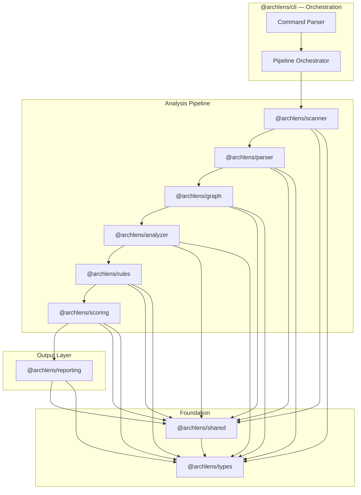

# ARCH-007 — High-Level System Architecture

---

## Metadata

| Field       | Value                         |
| ----------- | ----------------------------- |
| Document ID | ARCH-007                      |
| Version     | 1.0.0                         |
| Status      | DRAFT                         |
| Owner       | ArchLens Core Team            |
| Created     | 2026-06-02                    |
| Phase       | Phase 2 — System Architecture |
| Depends On  | ARCH-001 through ARCH-006     |

---

## Purpose

Defines the high-level system architecture of ArchLens — the monorepo structure, package boundaries, inter-package contracts, and the orchestration model that binds them.

---

## Scope

- Monorepo layout and package responsibilities.
- Inter-package dependency rules.
- Orchestration model (how the CLI drives the pipeline).
- Configuration flow.
- Error propagation strategy.

---

## System Overview



---

## Monorepo Structure

```
archlens/
├── apps/
│   ├── docs/                    # Documentation site (Docusaurus/Nextra)
│   └── playground/              # Interactive playground (future)
├── packages/
│   ├── scanner/                 # L0: Repository ingestion
│   ├── parser/                  # L1: Structural parsing
│   ├── graph/                   # L2: Dependency graph construction
│   ├── analyzer/                # L3: Pattern recognition and metrics
│   ├── rules/                   # L4: Rule evaluation
│   ├── scoring/                 # L5: Score computation
│   ├── reporting/               # Output formatting
│   ├── cli/                     # CLI orchestration
│   ├── shared/                  # Common utilities
│   └── types/                   # Shared type definitions
├── examples/                    # Example repositories for testing
├── turbo.json                   # Turborepo configuration
├── pnpm-workspace.yaml          # pnpm workspace definition
├── tsconfig.base.json           # Shared TypeScript config
└── package.json                 # Root package.json
```

---

## Package Responsibilities

| Package               | Responsibility                                           | Input Type                                      | Output Type        |
| --------------------- | -------------------------------------------------------- | ----------------------------------------------- | ------------------ |
| `@archlens/types`     | Shared type definitions and interfaces                   | —                                               | Type exports only  |
| `@archlens/shared`    | Common utilities (logging, file utils, result types)     | —                                               | Utility exports    |
| `@archlens/scanner`   | Discover and filter source files in a repository         | `ScannerConfig`                                 | `FileManifest`     |
| `@archlens/parser`    | Parse source files into structural representations       | `FileManifest`                                  | `ModuleMap`        |
| `@archlens/graph`     | Build and query dependency graphs                        | `ModuleMap`                                     | `DependencyGraph`  |
| `@archlens/analyzer`  | Compute metrics and detect patterns                      | `DependencyGraph`                               | `AnalysisResult`   |
| `@archlens/rules`     | Evaluate architectural rules against analysis            | `AnalysisResult` + `RuleSet`                    | `ViolationSet`     |
| `@archlens/scoring`   | Compute architecture scores from analysis and violations | `AnalysisResult` + `ViolationSet`               | `ScoreCard`        |
| `@archlens/reporting` | Format results into human/machine-readable reports       | `ScoreCard` + `ViolationSet` + `AnalysisResult` | `Report`           |
| `@archlens/cli`       | Parse CLI args, orchestrate pipeline, handle output      | User input                                      | Exit code + output |

---

## Dependency Rules

### Allowed Dependencies

```
cli → reporting, scoring, rules, analyzer, graph, parser, scanner, shared, types
reporting → scoring, types, shared
scoring → analyzer, rules, types, shared
rules → analyzer, types, shared
analyzer → graph, types, shared
graph → parser, types, shared
parser → scanner, types, shared
scanner → types, shared
shared → types
types → (nothing)
```

### Forbidden Dependencies

- No package depends on `cli` (CLI is the top-level consumer).
- No circular dependencies at any level.
- No lateral dependencies between packages at the same hierarchy level (e.g., `rules` cannot depend on `scoring`).
- `types` depends on nothing.
- `shared` depends only on `types`.

---

## Orchestration Model

The CLI orchestrates the pipeline as a sequential chain. Each stage is called explicitly — there is no automatic pipeline discovery or middleware pattern.

```typescript
// Simplified orchestration (conceptual)
async function analyze(path: string, options: CLIOptions): Promise<Report> {
    const manifest = await scan(path, options);
    const moduleMap = await parse(manifest);
    const graph = await buildGraph(moduleMap);
    const analysis = await analyze(graph);
    const violations = await evaluateRules(analysis, defaultRules);
    const scores = await computeScores(analysis, violations);
    const report = await generateReport(
        scores,
        violations,
        analysis,
        options.format,
    );
    return report;
}
```

**Why sequential, not event-driven or middleware**: The pipeline is a fixed sequence. There is no branching, no conditional stage skipping, no parallel stage execution in the MVP. A simple sequential call chain is the most readable, debuggable, and testable approach. Middleware patterns add indirection without value for a fixed pipeline.

---

## Configuration Flow

In the MVP, configuration comes from CLI flags only. The flow:

```
CLI flags → CLIOptions (validated) → Per-stage configs (derived)
```

Each stage receives only the configuration it needs, derived from the top-level `CLIOptions`:

| Stage     | Config Derived From                    |
| --------- | -------------------------------------- |
| Scanner   | `path`, `exclude` flags                |
| Parser    | No config needed (uses scanner output) |
| Graph     | No config needed                       |
| Analyzer  | No config needed                       |
| Rules     | Default rule set (built-in)            |
| Scoring   | Default thresholds (built-in)          |
| Reporting | `format`, `output` flags               |

---

## Error Propagation

Errors propagate up the pipeline via `Result<T, ArchLensError>` types. The CLI is the only layer that converts errors to user-facing messages and exit codes.

| Error Category      | Example                                    | Handling                                  |
| ------------------- | ------------------------------------------ | ----------------------------------------- |
| Input Error         | Path does not exist, not a directory       | Fail fast with descriptive message        |
| Parse Error         | File contains syntax that cannot be parsed | Skip file, log warning, continue analysis |
| Analysis Error      | Graph operation fails (internal bug)       | Fail with error report and context        |
| Configuration Error | Invalid flag combination                   | Fail fast with usage help                 |

**Principle**: Pipeline stages never swallow errors. They either handle them (skip + warn) or propagate them.

---

## Package Internal Structure

Each package follows a consistent internal structure:

```
packages/<name>/
├── src/
│   ├── index.ts              # Public API (re-exports)
│   ├── <feature>.ts          # Implementation files
│   └── <feature>.test.ts     # Co-located tests
├── package.json
├── tsconfig.json
├── tsup.config.ts            # Build configuration
└── README.md
```

- `index.ts` is the only entry point. Internal modules are not importable from outside.
- Tests are co-located with source files.
- Each package has its own `tsconfig.json` extending `tsconfig.base.json`.

---

## Decision Log

| ID     | Decision                                 | Rationale                                                     |
| ------ | ---------------------------------------- | ------------------------------------------------------------- |
| DL-026 | Sequential pipeline orchestration        | Fixed pipeline; no value in middleware/event patterns for MVP |
| DL-027 | CLI as sole orchestrator                 | Single entry point simplifies debugging and testing           |
| DL-028 | Result types for error propagation       | Explicit error handling over thrown exceptions                |
| DL-029 | Config derived per-stage from CLIOptions | Stages receive only what they need; prevents config coupling  |
| DL-030 | Consistent internal package structure    | Reduces cognitive load across packages                        |

---

_End of ARCH-007_
