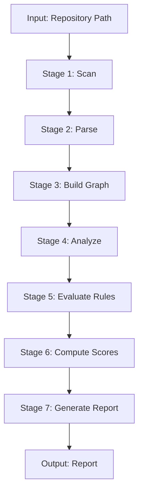

# ARCH-008 — Repository Analysis Pipeline

---

## Metadata

| Field       | Value                         |
| ----------- | ----------------------------- |
| Document ID | ARCH-008                      |
| Version     | 1.0.0                         |
| Status      | DRAFT                         |
| Owner       | ArchLens Core Team            |
| Created     | 2026-06-02                    |
| Phase       | Phase 2 — System Architecture |
| Depends On  | ARCH-007                      |

---

## Purpose

Details the end-to-end repository analysis pipeline — the sequence of operations from receiving a file system path to producing a complete analysis report.

---

## Scope

- Pipeline stages and their contracts.
- Data transformations at each stage.
- Error handling within the pipeline.
- Performance considerations.

---

## Pipeline Overview



---

## Stage 1: Scan

**Package**: `@archlens/scanner`

**Input**: Repository root path + exclusion patterns.

**Process**:

1. Validate the path exists and is a directory.
2. Recursively walk the directory tree.
3. Filter files by supported extensions (`.ts`, `.tsx`, `.js`, `.jsx`).
4. Apply exclusion patterns (`node_modules`, `.git`, `dist`, `build`, user-defined).
5. Collect file metadata (path, size, extension).

**Output**: `FileManifest` — ordered list of source files with metadata.

**Error handling**:

- Path does not exist → `Result.err(PathNotFound)`.
- Path is a file, not a directory → `Result.err(NotADirectory)`.
- No source files found after filtering → `Result.err(NoSourceFiles)`.
- Permission denied on subdirectory → Skip directory, log warning, continue.

---

## Stage 2: Parse

**Package**: `@archlens/parser`

**Input**: `FileManifest`.

**Process**:

1. For each file in the manifest, parse the TypeScript/JavaScript AST.
2. Extract import declarations (static imports, dynamic imports, type-only imports).
3. Extract export declarations (named exports, default exports, re-exports).
4. Resolve import specifiers to file paths using Node.js module resolution.
5. Build per-file structural data.

**Output**: `ModuleMap` — map of file paths to their structural representations (`ModuleInfo`).

**Error handling**:

- File cannot be parsed (syntax error) → Skip file, log warning with file path and error, continue.
- Import cannot be resolved → Record as unresolved import, continue. Unresolved imports are included in the analysis as a metric.

---

## Stage 3: Build Graph

**Package**: `@archlens/graph`

**Input**: `ModuleMap`.

**Process**:

1. Create a graph node for each file in the module map.
2. Create typed edges for each resolved import:
    - `static` — standard import statement
    - `dynamic` — `import()` expression
    - `type-only` — `import type` statement
    - `re-export` — `export { x } from './y'`
3. Optionally collapse file-level graph to package/directory-level graph.
4. Compute basic graph metadata (node count, edge count, density).

**Output**: `DependencyGraph` — typed directed graph with nodes, edges, and metadata.

**Error handling**: This stage should not fail under normal conditions. Graph construction from a valid `ModuleMap` is deterministic. Internal errors indicate bugs.

---

## Stage 4: Analyze

**Package**: `@archlens/analyzer`

**Input**: `DependencyGraph`.

**Process**:

1. Detect all cycles (circular dependencies) using Tarjan's algorithm or equivalent.
2. Compute per-node metrics:
    - Fan-in (afferent coupling, Ca)
    - Fan-out (efferent coupling, Ce)
    - Instability index: Ce / (Ca + Ce)
3. Compute graph-level metrics:
    - Total cycle count
    - Maximum dependency depth
    - Average fan-out
    - Dependency density (edges / possible edges)
4. Identify structural patterns:
    - Hub modules (high fan-in)
    - God modules (high fan-in AND high fan-out)
    - Leaf modules (zero fan-out)
    - Orphan modules (zero fan-in AND zero fan-out, excluding entry points)
    - Bottleneck modules (disproportionate fan-in relative to system average)

**Output**: `AnalysisResult` — computed metrics, detected patterns, and structural anomalies with evidence.

---

## Stage 5: Evaluate Rules

**Package**: `@archlens/rules`

**Input**: `AnalysisResult` + `RuleSet` (default rules in MVP).

**Process**:

1. For each rule in the rule set:
   a. Evaluate the rule against the analysis result.
   b. If violated, create a `Violation` with:
    - Rule ID and name
    - Severity (error, warning, info)
    - Location (modules/files involved)
    - Evidence (the specific metrics/patterns that triggered the violation)
    - Description (human-readable explanation)

**Output**: `ViolationSet` — list of violations with evidence chains.

**Default rules** (see ARCH-005 for details):

- `no-circular-deps` — Error
- `max-fan-out` — Warning (threshold: 15)
- `max-depth` — Warning (threshold: 10)
- `boundary-violation` — Error
- `orphan-modules` — Info

---

## Stage 6: Compute Scores

**Package**: `@archlens/scoring`

**Input**: `AnalysisResult` + `ViolationSet`.

**Process**:

1. Compute dimensional scores (0–100 each):
    - **Dependency Health**: f(cycle count, max depth, instability distribution, unresolved imports)
    - **Maintainability**: f(average coupling, boundary clarity, module independence)
    - **Technical Debt**: f(violation count, violation severity weights)
    - **Scalability**: f(bottleneck concentration, module independence, partitioning potential)
2. Compute aggregate Architecture Score as weighted average of dimensional scores.
3. For each score, build an evidence summary explaining the major contributing factors.

**Output**: `ScoreCard` — dimensional scores, aggregate score, and evidence summaries.

**Scoring formulas** are defined in detail in ARCH-012.

---

## Stage 7: Generate Report

**Package**: `@archlens/reporting`

**Input**: `ScoreCard` + `ViolationSet` + `AnalysisResult` + format options.

**Process**:

1. Select output formatter based on requested format (console, markdown, JSON).
2. Render the report with:
    - Score summary (all dimensions + aggregate)
    - Violation list (grouped by severity)
    - Key findings (top metrics and patterns)
    - Evidence details (for each score and violation)
3. Write to stdout or file as configured.

**Output**: Formatted report string + exit code (0 if above threshold, 1 if below).

---

## Pipeline Data Lifecycle

```
String (path)
  → FileManifest (flat list)
    → ModuleMap (per-file data)
      → DependencyGraph (graph structure)
        → AnalysisResult (computed metrics)
          → ViolationSet (rule violations)
            → ScoreCard (scores)
              → Report (formatted output)
```

Each transformation is a pure function (modulo file system reads in Stage 1–2). All intermediate data structures are defined in `@archlens/types`.

---

## Decision Log

| ID     | Decision                                              | Rationale                                        |
| ------ | ----------------------------------------------------- | ------------------------------------------------ |
| DL-031 | 7-stage pipeline with strict input/output contracts   | Each stage is independently testable             |
| DL-032 | Parse errors skip files rather than failing pipeline  | Partial analysis is more useful than no analysis |
| DL-033 | Graph built from resolved imports, not raw specifiers | Resolved paths enable accurate cycle detection   |
| DL-034 | Tarjan's algorithm for cycle detection                | Well-understood, O(V+E), deterministic           |
| DL-035 | Exit code reflects threshold comparison               | Enables CI quality gate integration              |

---

_End of ARCH-008_
