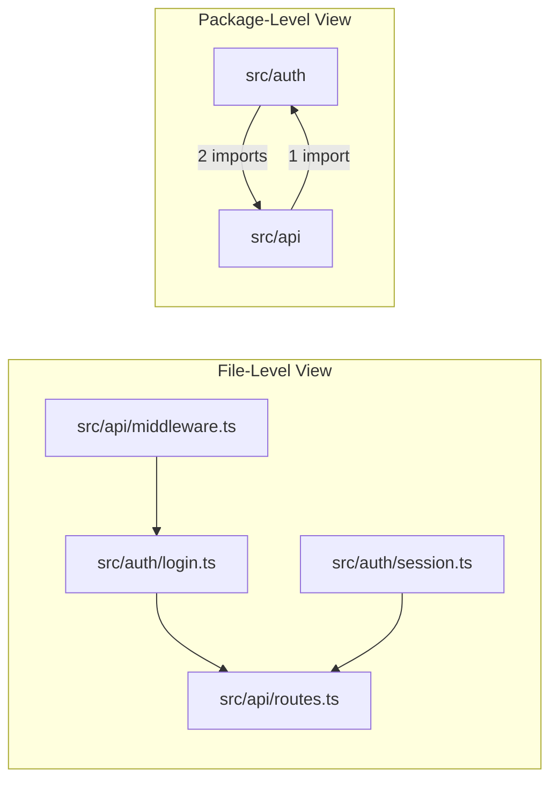

# ARCH-009 — Dependency Graph Architecture

---

## Metadata

| Field       | Value                         |
| ----------- | ----------------------------- |
| Document ID | ARCH-009                      |
| Version     | 1.0.0                         |
| Status      | DRAFT                         |
| Owner       | ArchLens Core Team            |
| Created     | 2026-06-02                    |
| Phase       | Phase 2 — System Architecture |
| Depends On  | ARCH-007, ARCH-008            |

---

## Purpose

Specifies the architecture of the dependency graph — the central data structure in ArchLens. Defines node/edge types, graph operations, storage format, and query capabilities.

---

## Scope

- Graph data model (nodes, edges, metadata).
- Edge type taxonomy.
- Graph construction algorithm.
- Graph operations (cycle detection, traversal, subgraph extraction).
- Granularity levels (file-level vs. package-level).

---

## Graph Data Model

### Nodes

A node represents a module — a source file or a logical package/directory.

```
GraphNode {
  id: string                    // Unique identifier (normalized file path)
  path: string                  // Absolute file path
  name: string                  // Module name (file basename or package name)
  type: 'file' | 'package'     // Granularity level
  metadata: {
    size: number                // File size in bytes
    exportCount: number         // Number of exports
    importCount: number         // Number of imports
  }
}
```

### Edges

An edge represents a dependency relationship between two modules.

```
GraphEdge {
  source: string                // Source node ID (the importer)
  target: string                // Target node ID (the imported)
  type: EdgeType                // Classification of the import
  metadata: {
    specifier: string           // Original import specifier
    line: number                // Line number of the import statement
  }
}
```

### Edge Types

| Type          | Description                   | Example                            |
| ------------- | ----------------------------- | ---------------------------------- |
| `static`      | Standard ES import            | `import { foo } from './bar'`      |
| `dynamic`     | Dynamic import expression     | `const m = await import('./bar')`  |
| `type-only`   | TypeScript type import        | `import type { Foo } from './bar'` |
| `re-export`   | Re-export from another module | `export { foo } from './bar'`      |
| `side-effect` | Side-effect import            | `import './setup'`                 |

**Why distinguish edge types**: Different import types carry different architectural weight. A `type-only` import creates a compile-time dependency that disappears at runtime. A `dynamic` import creates a runtime dependency that may be conditional. The analyzer and rules engine can use edge types to weight dependencies differently.

---

## Graph Object

```
DependencyGraph {
  nodes: Map<string, GraphNode>
  edges: GraphEdge[]
  metadata: {
    nodeCount: number
    edgeCount: number
    density: number              // edgeCount / (nodeCount * (nodeCount - 1))
    rootNodes: string[]          // Nodes with zero fan-in (entry points)
    leafNodes: string[]          // Nodes with zero fan-out
  }
}
```

---

## Graph Construction

### Algorithm

1. **Initialize**: Create empty graph.
2. **Add nodes**: For each entry in `ModuleMap`, create a `GraphNode`.
3. **Add edges**: For each resolved import in each module's structural data, create a `GraphEdge`.
4. **Classify edges**: Set edge type based on import declaration type.
5. **Compute metadata**: Calculate node count, edge count, density, identify roots and leaves.
6. **Optional — Package collapse**: If package-level granularity is requested, merge file-level nodes into package-level nodes and aggregate edges.

### Package Collapse

File-level graphs can be large and noisy. Package collapse creates a higher-level view:

1. Group nodes by their containing package/directory.
2. Create one package-level node per group.
3. Merge edges: if file A in package X imports file B in package Y, create one edge from X to Y.
4. Deduplicate edges (multiple file-level edges between the same packages become one package-level edge with a count).



---

## Graph Operations

### Cycle Detection

**Algorithm**: Tarjan's strongly connected components (SCC).

**Output**: List of `Cycle` objects, each containing the ordered list of nodes forming the cycle.

```
Cycle {
  nodes: string[]               // Node IDs in cycle order
  length: number                // Number of nodes in the cycle
  edges: GraphEdge[]            // Edges forming the cycle
}
```

### Transitive Closure

Compute all nodes reachable from a given node, directly or transitively. Used for impact analysis (if module X changes, which modules are affected?).

### Subgraph Extraction

Extract a subgraph containing only nodes matching a filter (e.g., all nodes in `src/domain/`). Useful for scoped analysis.

### Topological Sort

Sort nodes in dependency order. Fails (returns error) if cycles exist — this is expected and the cycle information is captured separately.

### Path Finding

Find the shortest dependency path between two nodes. Used for evidence chains ("Module A depends on Module B through this path: A → C → D → B").

---

## Granularity Levels

| Level             | Nodes Represent                 | Use Case                                        |
| ----------------- | ------------------------------- | ----------------------------------------------- |
| File              | Individual source files         | Detailed analysis, specific violation locations |
| Package/Directory | Directories or logical packages | High-level architecture view, boundary analysis |

MVP supports both levels. File-level is the default. Package-level is available via CLI flag.

---

## Tradeoffs

| Decision                                      | Tradeoff                                                                                                                                   |
| --------------------------------------------- | ------------------------------------------------------------------------------------------------------------------------------------------ |
| In-memory graph only (no persistent storage)  | (+) Simpler, no serialization. (−) Must rebuild on every run. Acceptable for MVP.                                                          |
| Tarjan's over Johnson's algorithm for cycles  | (+) O(V+E), finds all SCCs. (−) Does not enumerate all simple cycles (Tarjan finds components, not individual cycles). Sufficient for MVP. |
| Edge type classification at construction time | (+) Enables type-aware analysis. (−) Slightly more complex parser contract. Worth the added analysis capability.                           |

---

## Decision Log

| ID     | Decision                                                          | Rationale                                                |
| ------ | ----------------------------------------------------------------- | -------------------------------------------------------- |
| DL-036 | 5 edge types (static, dynamic, type-only, re-export, side-effect) | Each carries different architectural weight for analysis |
| DL-037 | In-memory graph, no persistence                                   | MVP simplicity; persistence is a post-MVP concern        |
| DL-038 | Package collapse as optional view                                 | Provides architectural overview without losing detail    |
| DL-039 | Tarjan's SCC for cycle detection                                  | Well-understood, efficient, deterministic                |

---

_End of ARCH-009_
