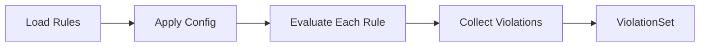

# ARCH-011 — Rule Engine Architecture

---

## Metadata

| Field       | Value                         |
| ----------- | ----------------------------- |
| Document ID | ARCH-011                      |
| Version     | 1.0.0                         |
| Status      | DRAFT                         |
| Owner       | ArchLens Core Team            |
| Created     | 2026-06-02                    |
| Phase       | Phase 2 — System Architecture |
| Depends On  | ARCH-008, ARCH-010            |

---

## Purpose

Specifies the rule engine — the component that evaluates architectural constraints against analysis results and produces violations with evidence chains.

---

## Scope

- Rule interface and lifecycle.
- Built-in rule definitions.
- Violation structure.
- Rule configuration model.
- Extensibility for custom rules (post-MVP design).

---

## Rule Interface

Every rule implements a single interface:

```
ArchitectureRule {
  id: string                          // Unique identifier (e.g., 'no-circular-deps')
  name: string                        // Human-readable name
  description: string                 // What this rule checks
  severity: 'error' | 'warning' | 'info'
  evaluate(context: RuleContext): Violation[]
}
```

Where `RuleContext` provides access to analysis data:

```
RuleContext {
  graph: DependencyGraph
  analysis: AnalysisResult
  config: RuleConfig               // Rule-specific configuration (thresholds, etc.)
}
```

---

## Rule Lifecycle



1. **Load**: Rules are loaded from the built-in rule set (MVP) or plugin registry (post-MVP).
2. **Configure**: Rule-specific configuration (thresholds, inclusions/exclusions) is applied.
3. **Evaluate**: Each rule receives the `RuleContext` and returns zero or more violations.
4. **Collect**: All violations are aggregated into a `ViolationSet`.

---

## Built-In Rules (MVP)

### `no-circular-deps`

| Attribute     | Value                                                 |
| ------------- | ----------------------------------------------------- |
| ID            | `no-circular-deps`                                    |
| Severity      | Error                                                 |
| Description   | Detects circular dependencies in the dependency graph |
| Input         | `AnalysisResult.cycles`                               |
| Violation per | Each cycle detected                                   |
| Evidence      | List of modules forming the cycle, in order           |

---

### `max-fan-out`

| Attribute         | Value                                                        |
| ----------------- | ------------------------------------------------------------ |
| ID                | `max-fan-out`                                                |
| Severity          | Warning                                                      |
| Default threshold | 15                                                           |
| Description       | Flags modules with outgoing dependencies exceeding threshold |
| Input             | Per-module fan-out from `AnalysisResult.metrics`             |
| Violation per     | Each module exceeding threshold                              |
| Evidence          | Module path, fan-out count, threshold, list of dependencies  |

---

### `max-depth`

| Attribute         | Value                                                     |
| ----------------- | --------------------------------------------------------- |
| ID                | `max-depth`                                               |
| Severity          | Warning                                                   |
| Default threshold | 10                                                        |
| Description       | Flags dependency chains exceeding maximum depth           |
| Input             | Per-module dependency depth from `AnalysisResult.metrics` |
| Violation per     | Each module exceeding depth threshold                     |
| Evidence          | Module path, depth value, the dependency chain            |

---

### `boundary-violation`

| Attribute     | Value                                                        |
| ------------- | ------------------------------------------------------------ |
| ID            | `boundary-violation`                                         |
| Severity      | Error                                                        |
| Description   | Detects imports crossing configured architectural boundaries |
| Input         | `DependencyGraph` edges + layer definitions                  |
| Violation per | Each edge crossing a boundary in the wrong direction         |
| Evidence      | Source module, target module, boundary definition violated   |

MVP uses convention-based boundaries (directory names: `domain`, `infrastructure`, `application`, `presentation`). Post-MVP adds explicit configuration.

---

### `orphan-modules`

| Attribute     | Value                                                             |
| ------------- | ----------------------------------------------------------------- |
| ID            | `orphan-modules`                                                  |
| Severity      | Info                                                              |
| Default       | Enabled                                                           |
| Description   | Detects modules with zero incoming and zero outgoing dependencies |
| Input         | Per-module fan-in and fan-out from `AnalysisResult.metrics`       |
| Violation per | Each orphan module                                                |
| Evidence      | Module path                                                       |

---

## Violation Structure

```
Violation {
  ruleId: string                    // Rule that was violated
  ruleName: string                  // Human-readable rule name
  severity: 'error' | 'warning' | 'info'
  message: string                   // Concise description of the violation
  modules: string[]                 // Modules involved
  evidence: Evidence                // Detailed evidence
}

Evidence {
  description: string               // Human-readable explanation
  metrics: Record<string, number>   // Relevant metrics
  chain: string[]                   // Dependency chain (for cycle/depth violations)
}
```

---

## ViolationSet

```
ViolationSet {
  violations: Violation[]
  summary: {
    total: number
    bySeverity: { error: number, warning: number, info: number }
    byRule: Record<string, number>
  }
}
```

---

## Rule Configuration (Post-MVP Design)

Post-MVP, rules will be configurable via `archlens.config.ts`:

```typescript
export default {
    rules: {
        "no-circular-deps": { severity: "error" },
        "max-fan-out": { severity: "warning", threshold: 20 },
        "max-depth": { severity: "error", threshold: 8 },
        "boundary-violation": {
            severity: "error",
            boundaries: [
                {
                    from: "infrastructure",
                    to: "domain",
                    direction: "forbidden",
                },
            ],
        },
        "orphan-modules": { severity: "off" }, // Disable rule
    },
};
```

In MVP, all rules use default configuration. No user-facing config.

---

## Decision Log

| ID     | Decision                                     | Rationale                                              |
| ------ | -------------------------------------------- | ------------------------------------------------------ |
| DL-044 | 5 built-in rules for MVP                     | Covers core architectural concerns without complexity  |
| DL-045 | Rules return violations (not booleans)       | Each violation carries evidence for explainability     |
| DL-046 | Convention-based boundaries in MVP           | Config-based boundaries require config file (post-MVP) |
| DL-047 | Rule severity is per-rule, not per-violation | Simplifies configuration and reporting                 |

---

_End of ARCH-011_
